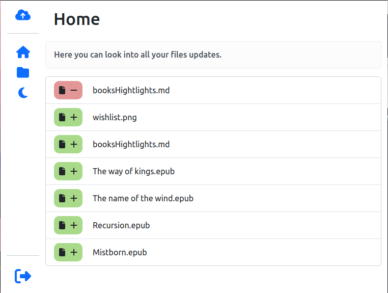
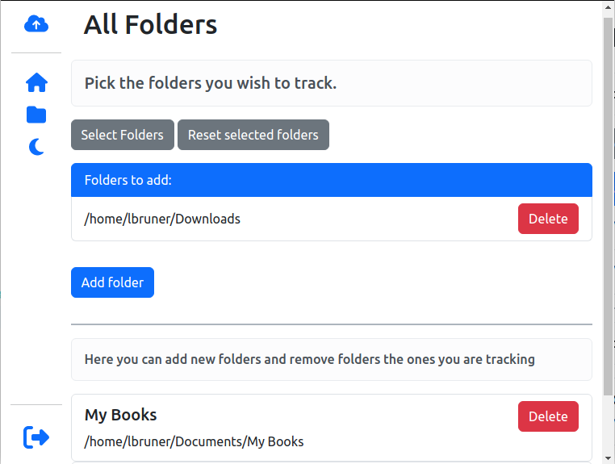

# Lindrive 💾

## Introduction 🚀

#### Welcome to the development overview of Lindrive, a Google Drive Clone for Linux OS.
This document provides an insight into the goals, technologies, and purpose behind the project. As of now, since I still got some features to implement and knowing the project can still change a lot,  I won't get into the details. You can find more details and my logs on it's creation on the [wiki](https://github.com/LBruner/lindrive/wiki) tab.

## Overview 🌟

**Lindrive** is an ongoing development aimed at creating a similar experience to what Google Drive is on the Windows
operating System. Currently, it doesn't have a Linux OS version available with the features it has on Windows. Being
able to select a folder path and track it for changes being the most important one. So for this reason, besides being a
great application to start growing my portfolio it will also help me automatically store my files.
  

## Technologies/Tools Used 💻

The project utilizes the following technologies:

- ElectronJS
- Typescript
- Google Drive API
- React
- React Router
- Redux
- Styled Components

## Development Progress 🚧

Currently, the project is in alpha stage. I have completed most of the features I initially thought, those being:

* Log into Google Account using oAuth
* Add/Delete folders which are going to be watched for file changes
* Files and folders change reflex into Google Drive Account
* Logs are displayed on the UI
* Loading screen and Notification popups

Features to still be added:

* Select whether hidden files should be tracked
* Dark and light mode change
* Settings screen

As said before, you can follow all the updates on this project through
the [wiki](https://github.com/LBruner/lindrive/wiki) page tab!

## Contact

For inquiries or more information, feel free to contact me:

---
Date: 08/25/2023
